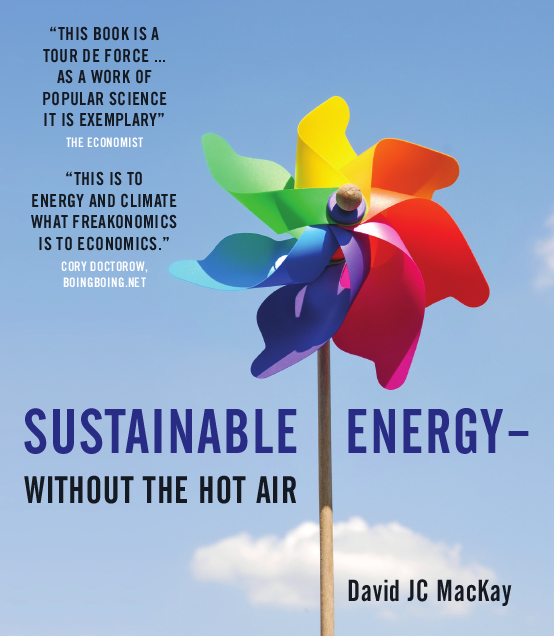

# Data Science Reading Club
> A list of recommended reading relating to Data Science.

<table>
  <tr>
    <td><strong>The Art of Statistics: Learning from Data</strong> David Spiegelhalter</td>
    <td><strong>Factfulness: Why Things Are Better Than You Think</strong> Hans Rosling, Ola Rosling, Anna Rosling Rönnlund</td>
    <td><strong>Big Data: Does Size Matter?</strong> Timandra Harkness</td>
  </tr>
  <tr>
    <td></td>
    <td></td>
    <td></td>
  </tr>

  <tr>
    <td><strong>Invisible Women: Data Bias in a World Designed for Men</strong> 
        Caroline Criado Perez</td>
    <td><strong>Sustainable Energy - Without the Hot Air</strong> 
        David JC MacKay</td>
    <td> </td>
  </tr>

  <tr>
    <td></td>
    <td></td>
    <td> </td>
  </tr>
</table>
